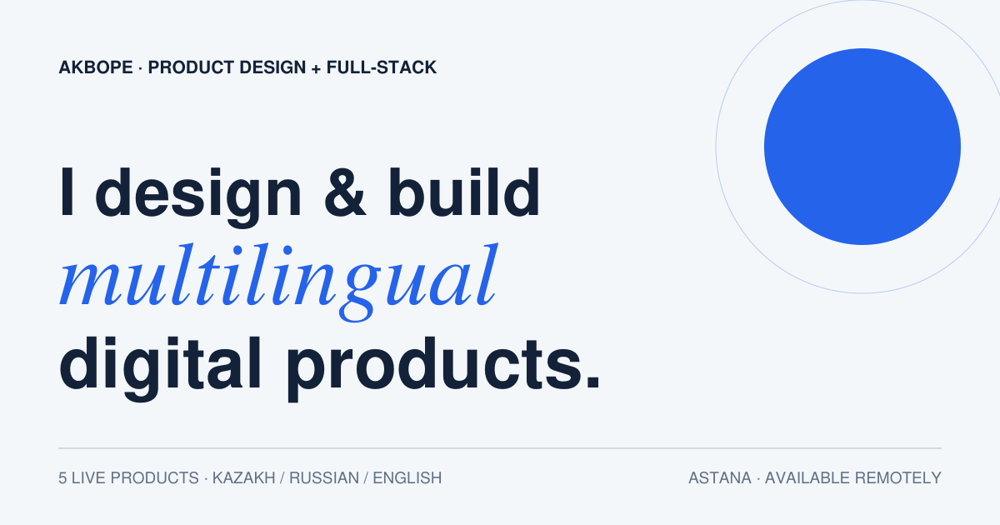

# Akbope - product design and full-stack portfolio

[Live portfolio](https://akiboupie.vercel.app/) · [Download CV](https://akiboupie.vercel.app/akbope-detailed-cv.pdf)



An editorial React portfolio positioned around one clear offer: designing and building multilingual learning and productivity products from product definition through UX, frontend, APIs, databases, testing and deployment.

## Selected work

The homepage leads with three working products, ordered by the strength of their verifiable evidence:

1. **Focus10** - full-stack productivity product with a guest workspace, PostgreSQL integrity constraints, RFC 4180 export and 127 automated tests.
2. **Agylshyn** - bilingual learning system covering 13 books, 937 units or test sections and 21,562 tracked questions.
3. **Mountain** - private multi-format reader with contextual Kazakh translation, vocabulary review, full-text search and device linking.

DOS Optics is clearly labelled as an independent concept and AIELTS as an experimental responsible-AI product.

## Portfolio structure

```text
src/main.jsx       routing, homepage sections and case-study components
src/projects.js    project evidence, metrics, links and offer definitions
src/styles.css     responsive blue, navy and mint design system
public/projects/   primary project covers
public/evidence/   authentic product screens used in case studies
scripts/           reproducible portfolio and CV PDF builders
output/pdf/        generated PDF deliverables
```

Each case study follows the same evidence-oriented sequence: challenge, responsibility, constraints, key decisions, annotated screens, system flow, validation, outcome and reflection. Claims are limited to shipped capabilities, audited content and documented tests; the site does not invent customer metrics or testimonials.

## Local setup

```bash
npm install
npm run dev
```

Production checks:

```bash
npm run check
npm run build
```

Vercel uses `npm run build`, publishes `dist`, and applies the client-side route rewrite in `vercel.json`.

## Content and asset updates

- Edit case-study copy, evidence and links in `src/projects.js`.
- Keep authentic screenshots in `public/evidence/` and include explicit dimensions in markup.
- Update both `public/og-image.svg` and its 1200x630 rendered `public/og-image.png` when positioning changes.
- Rebuild `output/pdf/akbope-portfolio.pdf` with `scripts/build_portfolio_pdf.py` after material portfolio edits.
- The same builder writes the landscape `akbope-product-fullstack-portfolio.pdf` and one-page `akbope-resume.pdf`; verified project screens live in `public/evidence/`.
- Keep working products, independent concepts and experimental products explicitly labelled.

## Remaining owner-supplied items

- Add a confirmed professional email to the contact section and structured data.
- Add real testimonials only after receiving permission from a client or collaborator.
- Add 45-60 second walkthrough videos for Focus10 and Agylshyn when recordings are available.

No analytics, secrets, fabricated testimonials or unverified business results are included.
